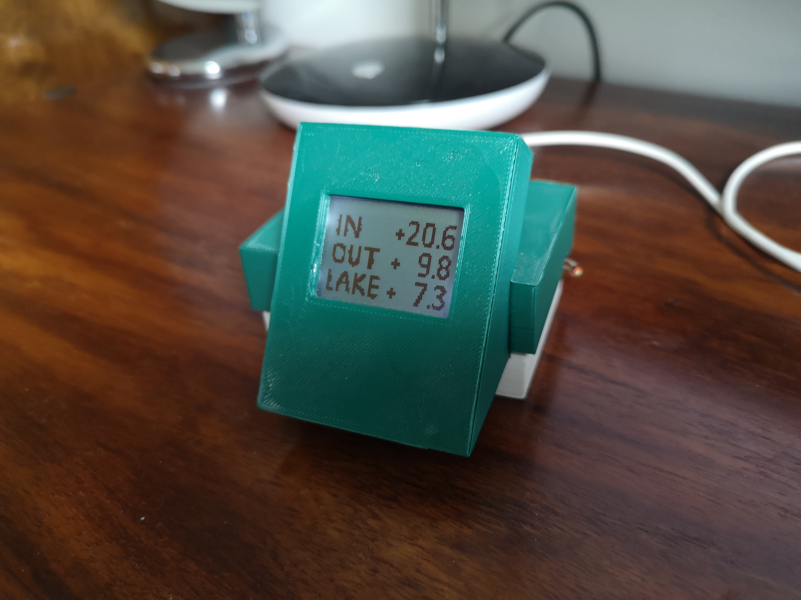

# Lämpötilanäyttö ja mittauspiste

## Hardware
- board: Lolin(Wemos) D1 mini pro, ESP8266
- display: Nokia5110
- sensor: ds18b20
- wifi (integrated to ESP8266)

## Arduinon libraries
- ESP8266 board: https://arduino-esp8266.readthedocs.io/en/latest/installing.html
- Adafruit GFX library (versio 1.10.12)
- Adarfuit PCD8544 Nokia 5110 LCD library (versio 1.2.1)
- ArduinoJson (version 6.19.4)
- DallasTemperature 3.9.0
- OneWire 2.3.7

## Toiminta
Program gets values of two sensors from server via graphql API (out, lake). Additionally it measures one temperature value itself and sends that to the server (in). 

